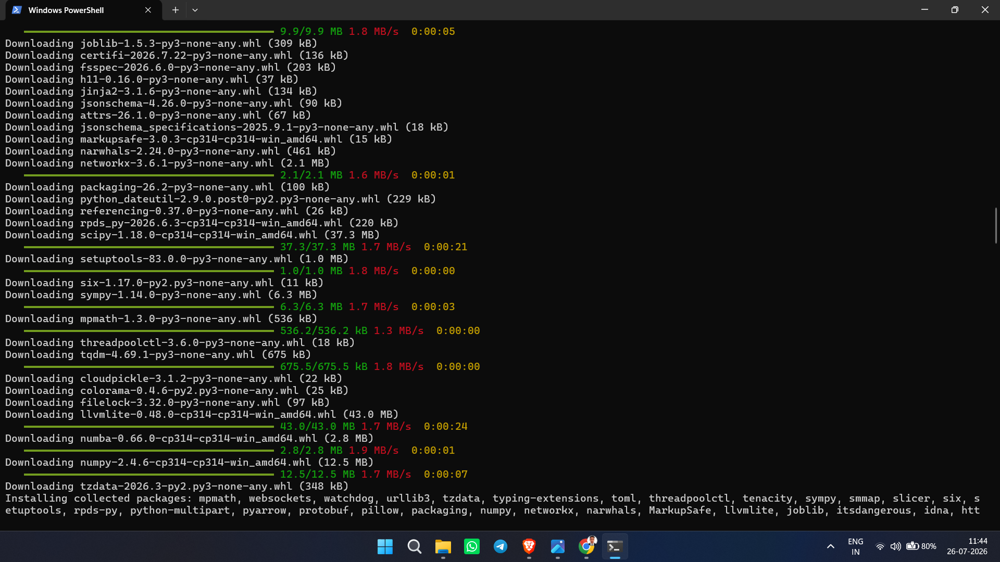
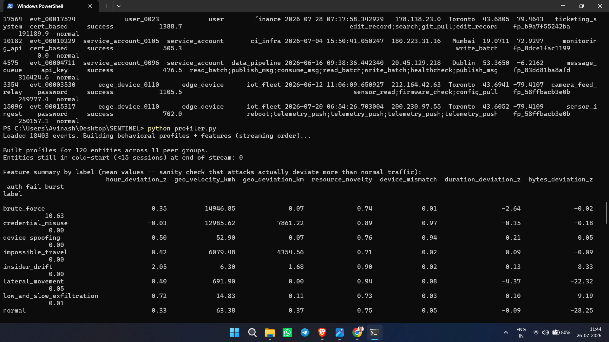
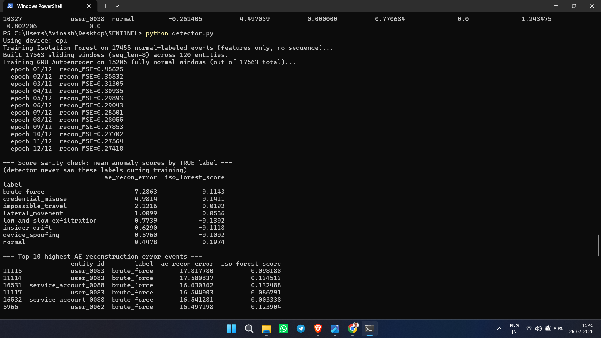
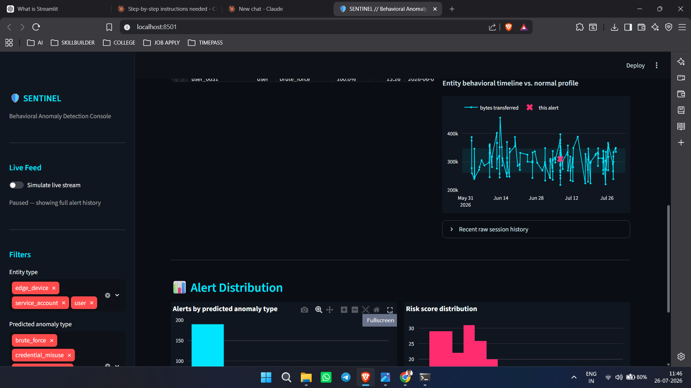
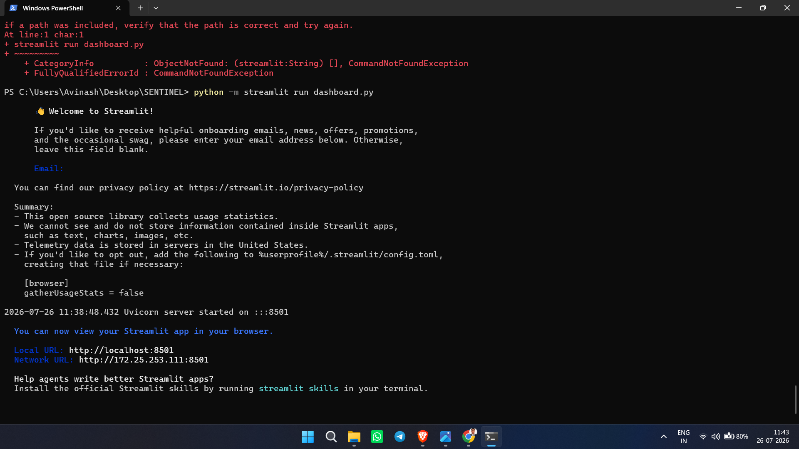
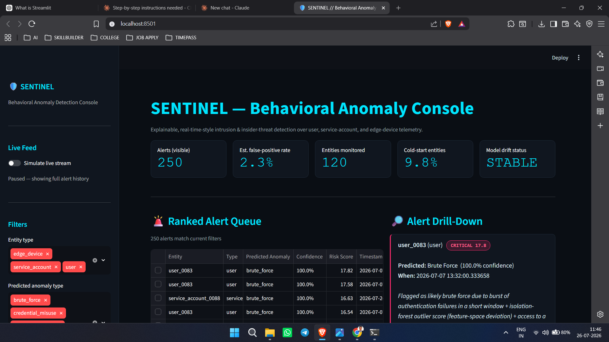
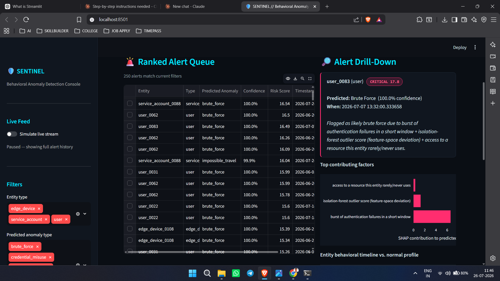
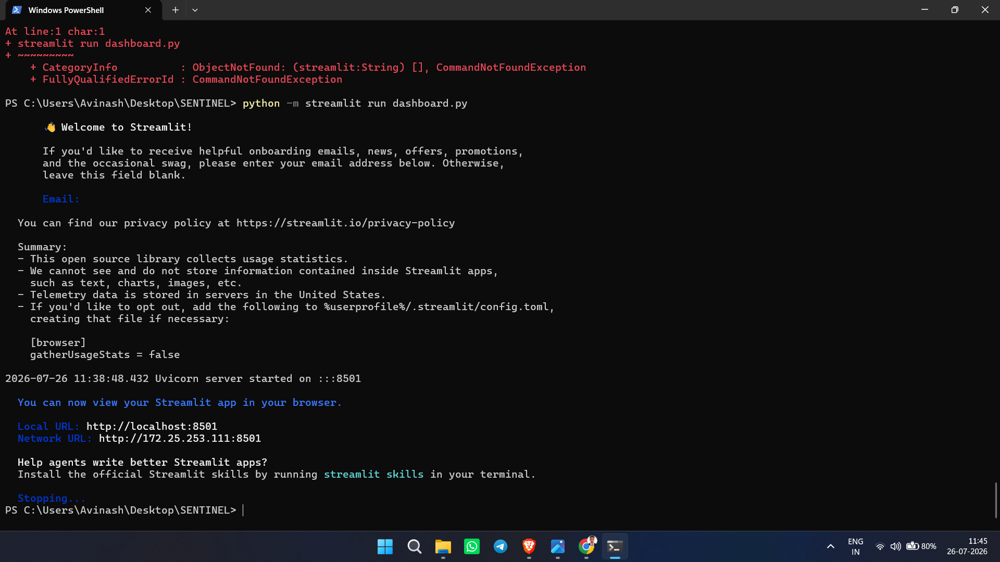

<div align="center">

# 🛡️ SENTINEL

### AI-Powered Behavioral Anomaly Detection for Cybersecurity

An explainable, sequence-aware intrusion & insider-threat detection prototype — models "normal" behavior per user, service account, and edge device, detects deviations in near real-time, classifies the attack type, and explains every alert in plain English through a live SOC analyst console.

**SIH Problem Statement:** Question 4A — *AI-Powered Behavioral Anomaly Detection for Cybersecurity*
**Theme:** Cybersecurity / Artificial Intelligence & Machine Learning · **Category:** Software

<!-- Add after recording -->
<!-- Demo Video: https://youtu.be/your-video-id -->

[]()
[]()
[]()
[]()
[]()
[]()

</div>

---

# 📌 Overview

SENTINEL is a production-style prototype for behavioral intrusion detection that models "normal" access and connection behavior for users, service accounts, and edge devices (cloud servers, edge gateways, POS terminals, IoT hubs), detects compromised-credential activity and insider drift in near real-time, and classifies the anomaly type with an explainable, analyst-readable risk score.

It was designed to explicitly address five hard constraints of real-world behavioral detection: sequential (not snapshot) data, extreme class imbalance, concept drift, explainability, and the cold-start problem — rather than treating them as afterthoughts.

---

# ✨ Features

## 🧬 Synthetic Behavioral Telemetry

- Persistent per-entity behavioral signature (habitual hours, home geo, typical resources, device fingerprint)
- 7 injected attack patterns with realistic mechanics: credential misuse, lateral movement, brute force, impossible travel, device spoofing, low-and-slow exfiltration, insider drift
- Batch (labeled) and streaming (unlabeled, real-time simulation) generation modes

---

## 📊 Behavioral Profiling

- Per-entity + peer-group rolling profiles (login hours, geo-centroid, resource histogram, device history)
- Exponential decay (EWMA) so profiles adapt to legitimate drift instead of freezing
- Peer-group fallback for cold-start entities (<15 personal sessions), linearly regaining personal trust as history accumulates

---

## 🔎 Dual Anomaly Detection

- **GRU Autoencoder** (primary, sequence-aware) — trained only on normal per-entity session sequences; reconstruction error = anomaly score
- **Isolation Forest** (baseline, fast) — engineered-feature outlier detection for low-latency scoring and cold-start entities
- Neither model is ever trained on labeled attack data — labels are reserved purely for threshold calibration and evaluation

---

## 🏷️ Attack-Type Classification

- LightGBM gradient-boosted classifier, trained only on already-flagged events
- 96%+ overall accuracy classifying which of the 7 attack patterns a flagged event resembles
- Doubles as the explainability backbone (tree-based SHAP)

---

## 💡 Explainability

- SHAP-based, plain-English reasons per alert (e.g. *"geo-velocity spike (impossible travel) + first-seen device fingerprint"*)
- Structured alert object: `{risk_score, predicted_type, confidence, top_contributing_features, entity_history_snippet, explanation}`

---

## 🖥️ Live SOC Dashboard

- Dark-mode, futuristic analyst console (Streamlit + Plotly)
- Ranked, filterable alert queue by risk score / entity type / anomaly type
- Drill-down per alert: SHAP contribution chart + entity behavioral timeline vs. normal profile
- KPI bar: alerts today, false-positive rate estimate, entities monitored, cold-start share, model drift status
- Simulated live-stream mode for a real-time demo feel

---

# 🛠 Tech Stack

## Modeling

- Python 3.12
- PyTorch (GRU Autoencoder)
- scikit-learn (Isolation Forest, preprocessing, metrics)
- LightGBM (attack-type classifier)
- SHAP (explainability)

---

## Data & Dashboard

- NumPy / Pandas / Faker (synthetic telemetry generation)
- PyArrow (Parquet storage)
- Streamlit (SOC analyst console)
- Plotly (interactive charts)

---

## Tools

- Git / GitHub
- Jupyter-free — fully scriptable CLI pipeline
- Windows PowerShell (development/demo environment)

---

# 📂 Project Structure

```
SENTINEL/
│
├── data_generator.py      # synthetic behavioral telemetry + attack injection
├── profiler.py             # per-entity + peer-group behavioral profiles
├── detector.py              # GRU Autoencoder + Isolation Forest detectors
├── classifier.py            # LightGBM attack-type classifier
├── explain.py                # SHAP-based structured alert explanations
├── dashboard.py               # Streamlit SOC analyst console
├── evaluate.py                 # PR-AUC / precision-recall-at-budget / ablation
│
├── data/                        # generated events, features, scored events
├── screenshots/                  # pipeline + dashboard screenshots (this README)
├── diagrams/                      # architecture diagram
│
├── REPORT.md / REPORT.pdf / REPORT.docx    # full evaluation report
├── PRESENTATION.pdf                          # SIH idea submission slide deck
└── README.md
```

---

# 🔎 Detection & Explainability Flow

```
Raw Events

↓

Behavioral Profiler (per-entity + peer-group, cold-start aware)

↓

┌───────────────────────┬───────────────────────┐
GRU Autoencoder                          Isolation Forest
(sequence recon. error)                  (single-event baseline)
└───────────────────────┴───────────────────────┘

↓

LightGBM Attack-Type Classifier

↓

SHAP Explainability Layer

↓

Live SOC Dashboard
```

---

# 📊 Dashboard Preview

### Ranked Alert Queue

> Alerts sorted by risk score, filterable by entity type and predicted anomaly type, with a live KPI bar (alerts visible, estimated false-positive rate, entities monitored, cold-start share, drift status).

---

### Alert Drill-Down

> Per-alert SHAP contribution chart and a plain-English explanation of exactly why an event was flagged — not just a bare score.

---

### Entity Behavioral Timeline

> Overlay of an entity's recent behavior (e.g. bytes transferred) against its own normal-profile band, with the flagged event marked.

---

### Alert Distribution

> Breakdown of alerts by predicted anomaly type and overall risk-score distribution across the monitored population.

---

# 🚀 Getting Started

## Clone Repository

```bash
git clone https://github.com/avinash09-cmd/sentinel-anomaly-detection.git

cd sentinel-anomaly-detection
```

---

## Install Dependencies

```bash
pip install numpy pandas faker scikit-learn pyarrow torch lightgbm shap streamlit plotly joblib
```

---

## Run the Pipeline

Each stage reads the previous stage's output, so run them in order the first time:

```bash
python data_generator.py --entities 120 --days 60 --attack-rate 0.035
python profiler.py
python detector.py
python classifier.py
python evaluate.py
```

---

## Launch the Dashboard

```bash
streamlit run dashboard.py
```

Opens at `http://localhost:8501`.

> On Windows PowerShell, if `streamlit run ...` isn't recognized, use `python -m streamlit run dashboard.py` instead.

---

# 📸 Screenshots

**Installing dependencies + generating synthetic data**


**Behavioral profiler run — feature summary by label**


**Detector training — GRU-Autoencoder + Isolation Forest**


**Attack-type classifier — report + confusion matrix + feature importances**


**Launching the live dashboard**


**Dashboard overview — KPI bar + ranked alert queue**


**Alert drill-down — SHAP contribution chart**


**Entity timeline + alert distribution charts**


Example:

```
Data Generator

Profiler

Detector

Classifier

Dashboard
```

---

# 🌟 Highlights

- Never trains a detector directly on imbalanced attack labels — fully unsupervised/semi-supervised detection
- Honest, non-cherry-picked ablation between a sequence-aware deep model and a fast interpretable baseline
- Cold-start handling via peer-group fallback profiles, not just a "no data" edge case
- SHAP-backed explainability on every single alert, not just aggregate model metrics
- Real-time-style, filterable, drill-down SOC analyst dashboard — not just an offline notebook
- Fully reproducible end-to-end with 5 sequential commands

---

# 📈 Future Improvements

- Federated learning across sites/tenants for shared behavioral baselines without sharing raw telemetry
- Graph-based lateral-movement detection (GNN embeddings over entity-resource access graphs)
- Active-learning loop — analyst feedback in the dashboard retrains the classifier and recalibrates thresholds
- Richer sequence inputs — raw command-sequence embeddings, multi-entity graph context
- Per-role drift tuning — learn the EWMA half-life per role/entity-type instead of one global constant

---

# 🤝 Contributing

Contributions, feature suggestions, and improvements are always welcome.

Feel free to fork the repository and open a Pull Request.

---

# 👨‍💻 Author

## Avinash Kumar Singh

Student ID: 23BCY10006

### Connect with me

- GitHub: https://github.com/avinash09-cmd

---

<div align="center">

### ⭐ If you found this project helpful, consider giving it a star!

Built with PyTorch, LightGBM, SHAP & Streamlit

</div>
